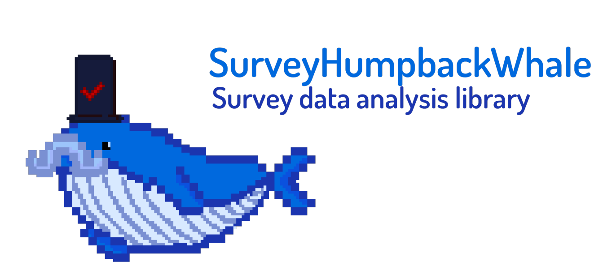

<h1 align="center">
    
</h1>

[](https://doi.org/10.5281/zenodo.3509134)

[](https://pypi.org/project/pandas/)


[](https://github.com/pandas-dev/pandas/blob/master/LICENSE)


A simple survey data analysis library for python language.

* Organized the csv data survey in dictionary for better visualization
* Automatic discretization of categorical variables with a knowledge corpus of linguistic particles
* Capabilities to combine the free answers with format answers from the same question
* Expand diverse question's answer in various columns in order of perform a better analysis
* Survey traduction throught a dictionary provide by the user


# Dependencies

This library require the next python modules:
* [NumPy](https://numpy.org/)
  
# Install process

The source code is hosted on this [repository](https://github.com/AlfonsoBarragan/SurveyHumpbackWhale/)

Binary installers for the latest released version are available at the [Python package index](https://pypi.org/).

```sh
pip3 install surveyHumpbackWhale
```


# License

WIP

# Documentation

The documentation can be found in pdf format on the next [link](https://github.com/AlfonsoBarragan/SurveyHumpbackWhale/blob/master/docs/_build/latex/surveyhumpbackwhale.pdf)

# Examples

Various examples of use of this library can be found on this [link](https://github.com/AlfonsoBarragan/SurveyHumpbackWhale/examples)

# Tests

The tests made to the library can be found on this [link](https://github.com/AlfonsoBarragan/SurveyHumpbackWhale/test)

